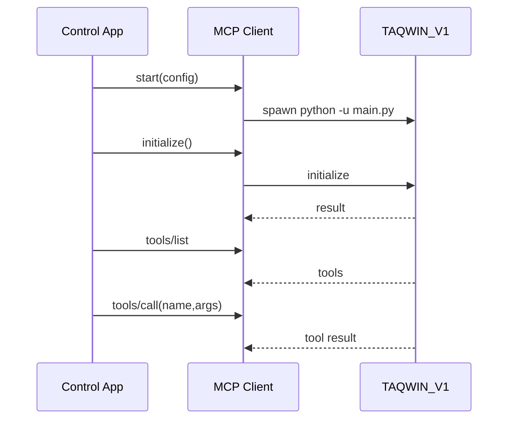

# Control App → KNEZ → TAQWIN (Runtime Relations)

Stamped: 2026-02-10

This document describes the real runtime topology and contracts between:
- knez-control-app (Tauri + React)
- KNEZ (FastAPI)
- TAQWIN_V1 (MCP server over stdio)

It is evidence-backed by code entrypoints and routes.

## Components (Topology)

```mermaid
flowchart LR
  subgraph UI[knez-control-app (Tauri + React)]
    UI_HTTP[KnezClient (HTTP)]
    UI_MCP[MCP Supervisor + Stdio Client]
    UI_REG[MCP Registry UI]
  end

  subgraph KZ[KNEZ FastAPI :8000]
    KZ_HEALTH[/health, /state/overview]
    KZ_CHAT[/v1/chat/completions]
    KZ_TAQ[/taqwin/events]
    KZ_MCP[/mcp/registry*]
  end

  subgraph AD[KNEZ/taqwin adapter :9001]
    AD_ANALYZE[/analyze]
  end

  subgraph TAQ[TAQWIN_V1 MCP Server (stdio)]
    TAQ_RPC[JSON-RPC 2.0 over stdio]
  end

  UI_HTTP -->|HTTP| KZ_HEALTH
  UI_HTTP -->|HTTP| KZ_CHAT
  UI_REG -->|HTTP| KZ_MCP

  AD_ANALYZE -->|HTTP chat| KZ_CHAT
  AD_ANALYZE -->|POST events| KZ_TAQ

  UI_MCP -->|spawn + stdio JSON-RPC| TAQ_RPC
```

## Server Entry Points

### KNEZ (FastAPI, :8000)
- Entrypoint: `KNEZ/run.py`
- App wiring: `KNEZ/knez/knez_core/app.py`
- TAQWIN integration route: `KNEZ/knez/integrations/taqwin/adapter.py`

### KNEZ TAQWIN Adapter (FastAPI, :9001)
- Entrypoint: `KNEZ/taqwin/server.py`
- Route: `POST /analyze` in `KNEZ/taqwin/handler.py`

### TAQWIN_V1 MCP (stdio)
- Entrypoint: `TAQWIN_V1/main.py` (MCP by default)
- MCP server: `TAQWIN_V1/core/mcp_server.py`

## Contracts

### Contract A — MCP (Control App ↔ TAQWIN_V1)
Transport:
- stdio (child process)
- JSON-RPC 2.0
- framing supported by TAQWIN_V1: line-delimited JSON and Content-Length

Minimal handshake:
1) `initialize`
2) `notifications/initialized` (best-effort)
3) `tools/list`
4) `tools/call`



### Contract B — TAQWIN Events (Adapter → KNEZ)
- Endpoint: `POST /taqwin/events`
- Behavior: validate payload, emit internal events, accept/reject

Pseudo-code:
```text
POST /taqwin/events:
  body = request.json
  parsed, ok = validate_payload(body)
  if not ok: return {status:"rejected"}
  emit_input_received(session_id, intent)
  emit_analysis_completed(session_id, len(observations))
  for proposal in proposals:
    emit_proposal_observed(session_id, proposal)
  return {status:"accepted"}
```

### Contract C — KNEZ Chat (Adapter → KNEZ)
- Endpoint: `POST /v1/chat/completions`
- Adapter converts request into `messages[]` and forwards to KNEZ.

## .taqwin Folder Role (Governance, Not Runtime)
- `.taqwin/` contains rules, checkpoints, reports, and architectural truth surfaces.
- It should not be treated as an HTTP API and should not be mutated by runtime components without explicit policy.
- It is the canonical place to keep:
  - checkpoints and ticket sets
  - diagrams explaining the runtime topology
  - evidence pointers (manifests, reports)

## Known Integration Risks (Enterprise Lens)
- Tauri shell permissions are powerful; least-privilege should be enforced for enterprise hardening.
- MCP framing negotiation must be deterministic and observable (no silent fallbacks).
- Config must be schema-versioned and migration-safe.
