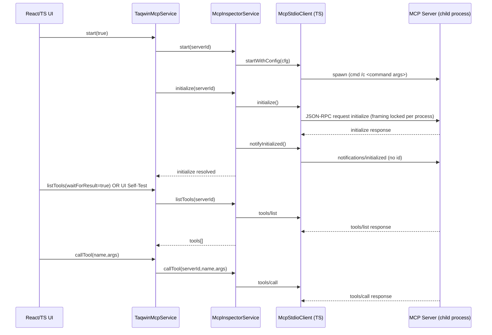
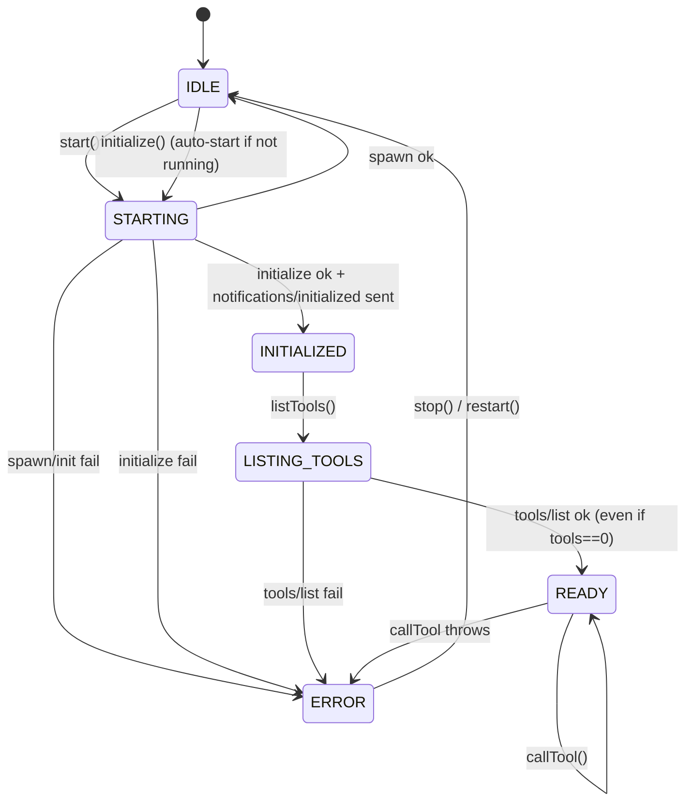
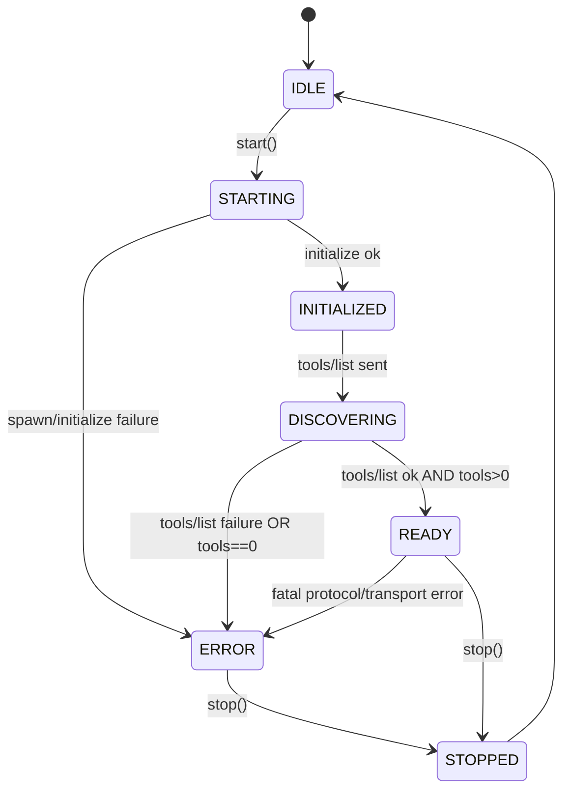
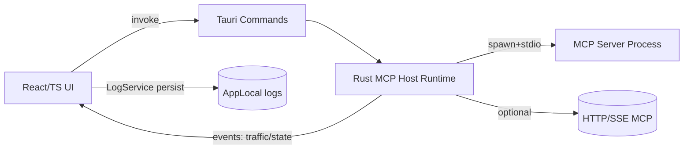

## Audit Report (PHASE 1 — No Code Changes)

### Scope Analyzed

- TS STDIO transport: [McpStdioClient.ts](file:///c:/Users/syedm/Downloads/ASSETS/controlAPP/knez-control-app/src/mcp/client/McpStdioClient.ts)
- TS HTTP/SSE transport: [McpHttpClient.ts](file:///c:/Users/syedm/Downloads/ASSETS/controlAPP/knez-control-app/src/mcp/client/McpHttpClient.ts)
- Host lifecycle + inspector: [McpInspectorService.ts](file:///c:/Users/syedm/Downloads/ASSETS/controlAPP/knez-control-app/src/mcp/inspector/McpInspectorService.ts)
- TAQWIN wrapper orchestration: [TaqwinMcpService.ts](file:///c:/Users/syedm/Downloads/ASSETS/controlAPP/knez-control-app/src/mcp/taqwin/TaqwinMcpService.ts)
- Config schema + normalization: [McpHostConfig.ts](file:///c:/Users/syedm/Downloads/ASSETS/controlAPP/knez-control-app/src/mcp/config/McpHostConfig.ts)
- Rust host prototype: [mcp_host.rs](file:///c:/Users/syedm/Downloads/ASSETS/controlAPP/knez-control-app/src-tauri/src/mcp_host.rs)
- Tauri Playwright assertions: [taqwin-mcp.spec.ts](file:///c:/Users/syedm/Downloads/ASSETS/controlAPP/knez-control-app/tests/tauri-playwright/taqwin-mcp.spec.ts)
- TAQWIN_V1 server behavior: [TAQWIN_V1/core/mcp_server.py](file:///c:/Users/syedm/Downloads/ASSETS/controlAPP/TAQWIN_V1/core/mcp_server.py)

---

### Current Handshake Flow Diagram (as implemented today)

Important: the Inspector enforces `notifyInitialized` after `initialize` now, and TAQWIN’s “canary tools/call” happens only after tools are discovered.

---

### Current Lifecycle State Machines (TS)

#### Inspector session state (per server)

Defined: `IDLE | STARTING | INITIALIZED | LISTING_TOOLS | READY | ERROR`.

Observed transitions:

References: [McpInspectorService.ts](file:///c:/Users/syedm/Downloads/ASSETS/controlAPP/knez-control-app/src/mcp/inspector/McpInspectorService.ts#L336-L464)

#### TAQWIN wrapper state (single active server)

Defined: `IDLE | STARTING | INITIALIZED | DISCOVERING | READY | ERROR`.

Notable: TAQWIN enforces “do not mark READY until tools/list succeeded”, but it can still temporarily return empty tools if `waitForResult=false`.

References: [TaqwinMcpService.ts](file:///c:/Users/syedm/Downloads/ASSETS/controlAPP/knez-control-app/src/mcp/taqwin/TaqwinMcpService.ts#L116-L541)

---

### Transport Implementation Details

#### STDIO transport (TS)

- Spawn: uses Tauri shell plugin; on Windows wraps everything in `cmd /d /s /c <command ...args>`: [McpStdioClient.ts](file:///c:/Users/syedm/Downloads/ASSETS/controlAPP/knez-control-app/src/mcp/client/McpStdioClient.ts#L128-L208)
- Writes: `child.write(Array.from(payload))` with request serialization queue `requestChain` to prevent write interleaving: [McpStdioClient.ts](file:///c:/Users/syedm/Downloads/ASSETS/controlAPP/knez-control-app/src/mcp/client/McpStdioClient.ts#L483-L584)
- Reads: accumulates stdout bytes and parses:
  - Content-Length framing (`Content-Length: N\r\n\r\n<body>`)
  - newline-delimited JSON
  - ignores non-JSON lines (log noise), scans for `{`/`[`
  - Response id handling: coerces to string key
  References: [McpStdioClient.ts](file:///c:/Users/syedm/Downloads/ASSETS/controlAPP/knez-control-app/src/mcp/client/McpStdioClient.ts#L283-L460)

#### HTTP + SSE transport (TS)

- JSON-RPC is sent as HTTP POST `Accept: application/json, text/event-stream`, with optional `Mcp-Session-Id` header persisted across calls: [McpHttpClient.ts](file:///c:/Users/syedm/Downloads/ASSETS/controlAPP/knez-control-app/src/mcp/client/McpHttpClient.ts#L167-L233)
- SSE parsing: collects `data:` lines until blank line, parses JSON per event. Uses response `id` to resolve pending promises; otherwise records as a response event: [McpHttpClient.ts](file:///c:/Users/syedm/Downloads/ASSETS/controlAPP/knez-control-app/src/mcp/client/McpHttpClient.ts#L124-L289)

---

### Framing Handling (Content-Length vs Line)

#### TS STDIO request framing

- Request framing is set once (via config env `KNEZ_MCP_CLIENT_FRAMING`) before the first write; subsequent changes are blocked by `hasWrittenRequest`: [McpStdioClient.ts](file:///c:/Users/syedm/Downloads/ASSETS/controlAPP/knez-control-app/src/mcp/client/McpStdioClient.ts#L69-L72)
- Initialize attempts:
  - Tries both framings, but **switches framing by restarting the process** (no mid-session flips): [McpStdioClient.ts](file:///c:/Users/syedm/Downloads/ASSETS/controlAPP/knez-control-app/src/mcp/client/McpStdioClient.ts#L596-L629)

#### TS STDIO response parsing

- Parses both framings regardless of request framing; does not “lock” response framing.

#### TAQWIN_V1 framing behavior

- TAQWIN reads both request framings and auto-selects response framing based on first request unless forced by `TAQWIN_MCP_OUTPUT_MODE`: [TAQWIN_V1/core/mcp_server.py](file:///c:/Users/syedm/Downloads/ASSETS/controlAPP/TAQWIN_V1/core/mcp_server.py#L608-L676)

---

### Protocol Version Fallback Logic

- TS STDIO initialize tries protocol versions `2024-11-05` then `1.0` across framings (with restarts): [McpStdioClient.ts](file:///c:/Users/syedm/Downloads/ASSETS/controlAPP/knez-control-app/src/mcp/client/McpStdioClient.ts#L596-L629)
- TS HTTP initialize tries `2024-11-05` then `1.0`: [McpHttpClient.ts](file:///c:/Users/syedm/Downloads/ASSETS/controlAPP/knez-control-app/src/mcp/client/McpHttpClient.ts#L335-L351)

Risk: fallback is unconditional (no error classification), which can increase retries/restarts and can mask real failures.

---

### Tool Registry and Gating Logic

#### Source of truth

- Tools are derived from `tools/list` response (`{ tools: [...] }`). No tool definitions are derived from initialize capabilities.

#### Current gating

- Inspector blocks `tools/list` and `tools/call` unless initialized has completed: [McpInspectorService.ts](file:///c:/Users/syedm/Downloads/ASSETS/controlAPP/knez-control-app/src/mcp/inspector/McpInspectorService.ts#L378-L464)
- Inspector blocks `tools/call` if tool name not present in cached tool list; it will auto-run `tools/list` if missing cache: [McpInspectorService.ts](file:///c:/Users/syedm/Downloads/ASSETS/controlAPP/knez-control-app/src/mcp/inspector/McpInspectorService.ts#L431-L457)
- TAQWIN wrapper blocks `callTool` if no tools exist after list, or tool name missing: [TaqwinMcpService.ts](file:///c:/Users/syedm/Downloads/ASSETS/controlAPP/knez-control-app/src/mcp/taqwin/TaqwinMcpService.ts#L543-L616)

Defect: the system can still consider itself READY even if `tools/list` returns an empty array.

---

### Restart / Shutdown Behavior

- TS STDIO stop sends `shutdown` request, then sends `exit` notification, then kills the process (with Windows taskkill fallback): [McpStdioClient.ts](file:///c:/Users/syedm/Downloads/ASSETS/controlAPP/knez-control-app/src/mcp/client/McpStdioClient.ts#L210-L247)
- Inspector stop resets status fields and clears cached tools: [McpInspectorService.ts](file:///c:/Users/syedm/Downloads/ASSETS/controlAPP/knez-control-app/src/mcp/inspector/McpInspectorService.ts#L290-L307)

---

### Race Condition / Reliability Risk Survey

#### TS side

- Per-server operation serialization exists (`opChains`), preventing concurrent start/initialize/list/call on the same server: [McpInspectorService.ts](file:///c:/Users/syedm/Downloads/ASSETS/controlAPP/knez-control-app/src/mcp/inspector/McpInspectorService.ts#L89-L100)
- STDIO writes serialized via `requestChain`.

However, a few protocol-level hazards remain (see defect matrix).

#### Rust side (mcp_host.rs)

- This is currently a **parallel runtime** with no handshake state machine and incomplete JSON-RPC semantics.
- Uses threads + `mpsc` pending map; timeouts return a generic `mcp_request_timeout`.

---

### Mixed Rust + TS Runtime Conflict Assessment

- Today, TS host (Inspector + McpStdioClient/McpHttpClient) is the production path.
- Rust host exists and is wired into Tauri commands, but the React/TS code does not appear to use it yet.

Defect: dual runtime authority is possible. The system needs a single authority selection and hard disable of the other.

---

## Defect Matrix (PHASE 1 output)

Severity key: P0 = correctness/safety; P1 = reliability; P2 = debuggability/maintainability.

| Defect | Where | Symptom | Root Cause | Severity |
|---|---|---|---|---|
| Duplicate initialize allowed per process | TS STDIO + Inspector | Server sees multiple initialize; spec violation | No “handshake completed” guard; `initialize()` callable repeatedly | P0 |
| READY can occur with tools==0 | Inspector + TAQWIN wrapper | UI says READY but no tools; later calls fail | `tools/list` does not enforce non-empty invariant | P0 |
| Protocol fallback unconditional | STDIO/HTTP | Extra restarts/attempts; masks actual errors | No error classification to decide fallback | P1 |
| Unmatched success responses silently dropped | STDIO onMessage | Lost responses appear as timeouts upstream | If id not in pending map, response is ignored unless it’s an error | P1 |
| Rust host ignores numeric JSON-RPC ids | Rust mcp_host.rs | Requests time out though server responded | Uses `id.as_str()` only; numeric ids are ignored | P0 |
| Rust host has no shutdown/exit; pending cleanup | Rust mcp_host.rs | Pending leaks; nondeterministic stop | Stop kills child only; pending senders remain | P1 |
| Rust host has no handshake state machine | Rust mcp_host.rs | Tools/call can be sent before tools/list | No invariant enforcement | P0 |
| Rust host parsing is fragile to log noise | Rust mcp_host.rs | Mis-parse leads to timeouts | Line parsing doesn’t scan for JSON start; only splits on newline | P1 |
| TS stop uses short shutdown timeout | TS STDIO stop | Clean shutdown may be skipped | Fixed 1200ms budget; not per-server configurable | P2 |
| Timeout classification too coarse | TS + Rust | “timeout” lacks phase context | Single error string `mcp_request_timeout` | P1 |
| Capabilities ignored entirely | TS host | Potentially misses server features/constraints | No parsing/recording of initialize result capabilities | P2 |
| Server-agnostic spawn not implemented | TS STDIO | Linux/macOS configs broken | Windows-only custom config path uses `cmd` | P0 |
| Log routing constraint violated by Rust | Rust host | Diagnostics not in LogService | Emits Tauri events, doesn’t flow through LogService | P2 |

Additional non-fatal concerns:
- tools/list timeout root causes are often external (server blocking / KNEZ unreachable). Inspector has `ensureKnezHealthy()` which can convert this into explicit `knez_unreachable` errors (good) but can also conflate MCP vs dependency failures.

---

## Design Corrections (PHASE 2 — Spec-Correct MCP Host)

### Core Invariants (enforced in one place)

1. Spawn → initialize → notifications/initialized → tools/list → READY
2. initialize sent exactly once per process
3. notifications/initialized sent once
4. tools/list required and must produce non-empty tools for READY
5. No tools/call before READY
6. Framing locked after first write
7. Framing fallback requires process restart
8. Protocol version negotiated once and recorded
9. shutdown → exit → kill is the stop contract
10. Pending requests:
   - strict map, no silent drops
   - timeouts are phase-classified
   - cleanup on stop and on process exit

### Deterministic State Machine (canonical)

### Transport Rules

- STDIO
  - Request framing locked per process
  - Parse both framings
  - Restart only during handshake fallback (not mid-session)
  - Support Windows + POSIX spawn strategies
- HTTP/SSE
  - Strict sessionId tracking
  - SSE parser supports partial frames and multi-event
  - Explicit non-2xx error classification

### Strict Request Routing

- Id generator: monotonic + process scoped
- Pending map with:
  - phase-specific timeout
  - leak detection at stop
  - response always recorded (including unsolicited)
- No silent drop:
  - if response id unknown → record traffic + raise “unsolicited_response” metric

### Capability Handling

- Parse initialize result:
  - protocolVersion accepted
  - serverInfo stored
  - capabilities stored but **not** used as tool source-of-truth
- tools/list is source-of-truth
- If tools/list empty → explicit `mcp_server_no_tools`

---

## Server-Agnostic Compatibility (PHASE 3)

- Spawn profiles:
  - Windows: `cmd /d /s /c`
  - POSIX: `/bin/sh -lc` with explicit quoting rules
  - direct exec when command is absolute
- Environment propagation and cwd validation:
  - normalize cwd; enforce exists
  - redact secrets in logs
- Python:
  - enforce `-u` / `PYTHONUNBUFFERED=1`
- Node:
  - support `npx -y <pkg>` and detect “npx prompts” failure mode

Diagnostics additions:
- per-server “transport trace” channel
- framing negotiation trace
- protocol negotiation trace
- method routing trace
- timeout classification

---

## Rust Native Host Consolidation (PHASE 4)

Decision required: pick one runtime authority.

- **Option A (Recommended): Rust owns lifecycle + JSON-RPC**
  - TS clients disabled in Tauri runtime
  - UI talks only to Rust commands
  - Rust emits structured events → UI → LogService persist

Minimum Rust command surface (as required):
- mcp_start
- mcp_stop
- mcp_request
- mcp_status
- mcp_list_tools
- mcp_get_traffic

Rust runtime must be upgraded from current prototype to:
- support numeric ids
- implement handshake state machine
- enforce READY gating
- implement shutdown/exit
- provide strict timeout classifications

---

## Hardened Debugging System (PHASE 5)

Replace generic `mcp_request_timeout` with classified errors:
- mcp_timeout_initialize
- mcp_timeout_tools_list
- mcp_timeout_tools_call
- mcp_protocol_error
- mcp_framing_error
- mcp_duplicate_initialize
- mcp_server_no_tools
- mcp_pending_leak_detected

Every transition and IO event is logged via LogService (not console-only):
- spawn command + pid
- initialize sent/received
- notify initialized sent
- tools/list sent/received
- tools/call sent/received
- shutdown sent
- exit sent
- process exited
- framing used
- protocol version negotiated
- restart cause
- duplicate initialize detection

---

## Automated Validation (PHASE 6)

Playwright assertions to cover:
- initialize before notify before tools/list before tools/call
- READY reached before any tools/call
- no duplicate initialize per process
- framing locked; restart occurs on handshake fallback
- clean shutdown: shutdown + exit + process exit
- no pending requests after stop
- tools/list > 0; if ==0 → explicit error surfaced

Target server matrix:
- Node stdio (npx shadcn)
- Official server-puppeteer
- TAQWIN_V1
- HTTP/SSE server

Current test already asserts ordering and shutdown/exit logs for TAQWIN flow: [taqwin-mcp.spec.ts](file:///c:/Users/syedm/Downloads/ASSETS/controlAPP/knez-control-app/tests/tauri-playwright/taqwin-mcp.spec.ts#L53-L86)

---

## Exact Patch Plan (what will be implemented after audit approval)

1) TS Host Hardening (if TS remains authority)
- Add `handshakeCompleted` and `protocolNegotiated` flags per process; reject duplicate initialize.
- Change `tools/list` READY transition to require `tools.length > 0`.
- Convert timeouts into phase-specific errors.
- Ensure all unsolicited responses/errors are stored in traffic and surfaced.
- Add POSIX spawn path and platform-aware config validation.

2) Rust Host Productionization (if Rust becomes authority)
- Implement the full state machine inside Rust and expose commands:
  - `mcp_start` runs handshake and ends only when READY
  - `mcp_list_tools` returns cached list
  - `mcp_request` blocks unless READY (except handshake internals)
- Upgrade JSON-RPC id handling to accept number/string.
- Add shutdown/exit contract and pending cleanup.
- Route all events to the frontend and persist through LogService.

3) Unify Runtime Authority
- Add a single feature flag / runtime switch:
  - Desktop (Tauri) uses Rust host
  - Web uses TS-only mock (no spawning)
- Hard disable TS spawning clients when Rust host is enabled.

4) Documentation
- Add:
  - mcp_lifecycle.md
  - mcp_debugging_guide.md
  - update mistakes.md

5) Tests
- Expand server matrix and add a “zero-tools server” fixture test.

---

## Refactored Architecture Diagram (target)

---

## Risk Analysis

- Highest risk: dual-runtime authority causing duplicated processes, duplicated initialize, or split tool registries.
- Cross-platform risk: current TS stdio spawn strategy is Windows-specific; production target must include POSIX.
- Protocol drift risk: unclassified version fallback can mask real failures; negotiation must be explicit.
- Observability risk: Rust-side events must be persisted through LogService to meet auditability requirements.

---

## Final Verification Checklist

- Handshake ordering observed in traffic for all servers.
- Exactly one initialize per process.
- notifyInitialized exactly once per process.
- tools/list required and tools>0 required for READY.
- No tools/call allowed before READY.
- Framing locked after first write; fallback uses restart.
- Protocol version negotiated once and recorded.
- shutdown→exit→kill always executed on stop.
- Pending map empty after stop; leaks detected and surfaced.
- All failures are classified and visible (not generic timeouts).
- No console-only diagnostics; logs persist via LogService.
- Non-MCP features unaffected.

