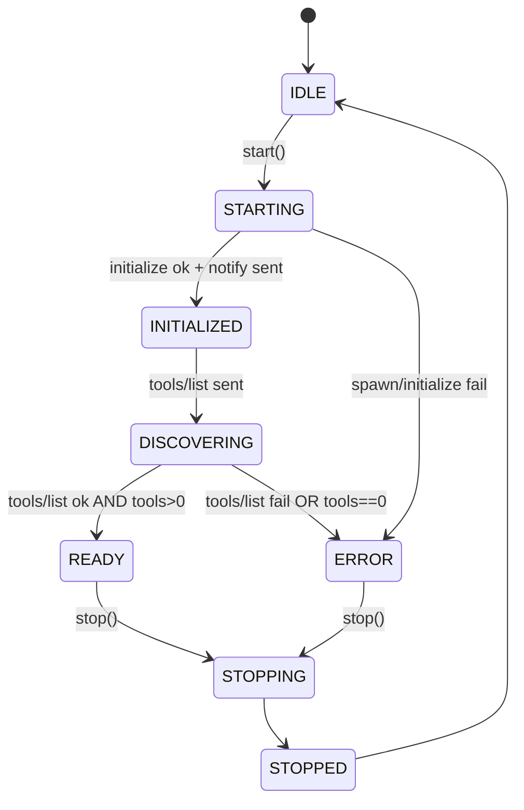

# MCP Lifecycle (knez-control-app)

## Runtime Authority

The desktop app supports two MCP host runtimes:

- `ts`: TypeScript host runtime (Inspector + TS transports)
- `rust`: Rust host runtime (Tauri backend owns process + JSON-RPC)

Authority is selected via `VITE_MCP_AUTHORITY`:

- `VITE_MCP_AUTHORITY=ts` (default): STDIO runs via `McpStdioClient`.
- `VITE_MCP_AUTHORITY=rust`: STDIO runs via Rust (`mcp_start/mcp_request/...`) and TS stdio spawning is disabled.

HTTP/SSE servers remain TS-owned.

## Canonical Handshake Contract

The host must reach READY only after this exact sequence completes:

1. Spawn process (stdio servers) or validate URL (http servers)
2. `initialize` request
3. `notifications/initialized` notification (no id)
4. `tools/list` request
5. Validate `tools.length > 0`
6. Transition to `READY`

No `tools/call` is permitted before READY.

## Canonical State Machine

## Transport Rules

### STDIO

- Request framing is locked per process after the first write.
- Response parsing accepts both Content-Length and newline-delimited JSON.
- If handshake fails due to framing mismatch, the process must be restarted and handshake retried.
- Protocol version is negotiated once (attempt order: `2024-11-05` then `1.0`).

### HTTP/SSE

- JSON-RPC requests are POSTed with `Accept: application/json, text/event-stream`.
- If SSE is used, the host must parse `data:` events and route responses by `id`.
- MCP Session ID (if provided) is stored and sent on subsequent requests.

## Shutdown Contract

On stop, the host performs best-effort:

1. `shutdown` request
2. `exit` notification
3. kill process
4. reject all pending requests and clear pending map

