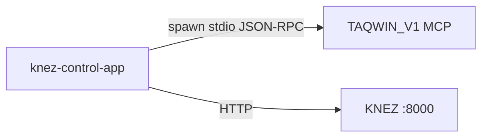

# TAQWIN MCP — Operator Guide (KNEZ Control App)

## Purpose
This guide explains how the desktop app (Tauri) hosts TAQWIN_V1 as an MCP server over STDIO, how to configure it, and how to diagnose failures quickly.

## Topology



## Runtime Model
- The desktop app spawns TAQWIN as a child process and communicates via JSON-RPC 2.0 over STDIN/STDOUT.
- The host sequence is: `initialize` → `tools/list` → `tools/call`.
- TAQWIN_V1 supports both line-delimited JSON and Content-Length framing.

References:
- TAQWIN_V1 runbook: [runbook.md](file:///c:/Users/syedm/Downloads/ASSETS/controlAPP/TAQWIN_V1/docs/operations/runbook.md)
- TAQWIN integration guide: [INTEGRATIONGUIDE.MD](file:///c:/Users/syedm/Downloads/ASSETS/controlAPP/docs/TAQWIN/MCP/INTEGRATIONGUIDE.MD)

## Configuration (Desktop)
The app reads and writes its MCP config from AppLocalData:
- `mcp.config.json`

Supported config inputs:
- `{ "schema_version": "1", "servers": { ... } }` (preferred)
- `{ "servers": { ... } }`
- `{ "mcpServers": { ... } }` (legacy)

Minimum required fields for TAQWIN_V1:
- `command`: Python executable (prefer absolute path)
- `args`: include `-u` and an absolute path to `TAQWIN_V1/main.py`
- `working_directory` / `cwd`: absolute path to `TAQWIN_V1/`
- `env.PYTHONUNBUFFERED`: `"1"`

### Example Config (Preferred)

```json
{
  "schema_version": "1",
  "servers": {
    "taqwin": {
      "command": "C:\\\\Path\\\\To\\\\python.exe",
      "args": [
        "-u",
        "C:\\\\Users\\\\syedm\\\\Downloads\\\\ASSETS\\\\controlAPP\\\\TAQWIN_V1\\\\main.py"
      ],
      "env": {
        "PYTHONUNBUFFERED": "1",
        "KNEZ_MCP_CLIENT_FRAMING": "line",
        "TAQWIN_MCP_OUTPUT_MODE": "line"
      },
      "working_directory": "C:\\\\Users\\\\syedm\\\\Downloads\\\\ASSETS\\\\controlAPP\\\\TAQWIN_V1"
    }
  }
}
```

## UI Surfaces
- Chat → Tools → “Start TAQWIN MCP”: starts MCP and loads tools.
- Chat header → “TAQWIN ACTIVATE”: activates TAQWIN for the current session.
- “Open MCP Logs”: opens the app console filtered to MCP events.

## Required MCP Tools (Operator Expectations)
- `tools/list` must include at minimum:
  - `get_server_status`
  - `debug_test`
- Activation tool name depends on server version:
  - `activate_taqwin_unified_consciousness` (TAQWIN_V1)
  - `taqwin_activate` (legacy)

## Common Failures and Fixes

### “TAQWIN tools require the desktop app (Tauri).”
- Cause: running in web mode where process spawn is unavailable.
- Fix: run the Tauri desktop build.

### “Invalid MCP config: mcp_config_missing_*”
- Cause: missing `command` or `working_directory/cwd`.
- Fix: open Tools → MCP Config and use the canonical schema.

### “stdin_write permission denied”
- Cause: Tauri capability missing `shell:allow-stdin-write`.
- Fix: ensure desktop capabilities include stdin write.

### “request timed out”
- Cause: process started but is not responding (wrong cwd, wrong python env, blocking stdout).
- Fix:
  - verify `working_directory` points to TAQWIN_V1
  - ensure unbuffered (`-u` and/or `PYTHONUNBUFFERED=1`)
  - open MCP logs and inspect stderr tail

### “taqwin_activate_tool_missing”
- Cause: server does not expose either activation tool name.
- Fix: verify tools list includes `activate_taqwin_unified_consciousness` (TAQWIN_V1) or `taqwin_activate` (older).

## Diagnostics Workflow
1. Tools → Self-Test: confirms start + tools/list + two tool calls.
2. Tools → Open MCP Logs: review recent stderr tail and audit entries.
3. If config changed: save config, then restart MCP.

## Audit Records
The app writes persistent audit entries for MCP traffic:
- `mcp_audit` category events include `tools/list` and `tools/call` with duration/bytes and ok/error.
